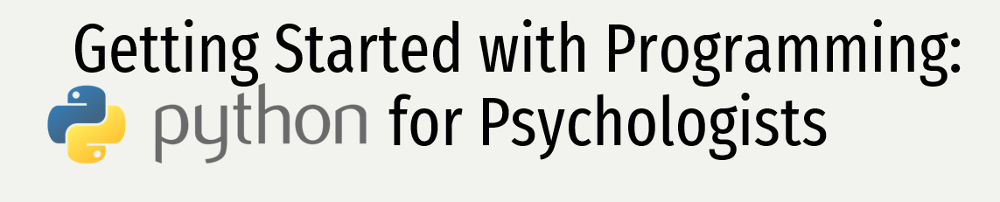

**🛠 🗳 Feel free to add questions or features you want explained as issues in the Github ! 📚 ✅**

This workshop is aimed at behavioural scientists with little to no prior experience in programming who are interested in
learning the fundamentals of Python. The materials (PDF slides) for this workshop offer some advice for those who are 'trying to get
into programming' but are not sure where to begin. 

In the workshop, I run through examples using the [repl.it](https://repl.it/) which offers an install-free way to
interact with the Python programming language. Alternatively, [LearnPython.org](https://www.learnpython.org/) offers an
guided tutorial alongside interactive code blocks, also with no installation required.

For those who are looking at actually using Python, you will need to install Python for your machine. Debian/Ubuntu
users can `sudo apt install python`. Mac users will have a Python interpreter installed, but I recommend you install a
fresh version so not as to mess with your system Python. Windows users can consult [this video if you get
lost](https://www.youtube.com/watch?v=IZj8hLrkABs), but instructions should work fine on Mac too.

However, I'm always a little split when offering advice to colleagues about the best way to install Python. Installing Python is
as easy as any other program. However, it is a very minimal installation. [Anaconda Python3 comes is a distribution of
Python](https://anaconda.org/anaconda/python) (meaning it ships with all the batteries included) targeted towards data
scientists. One massive benefit of Anaconda is that it installs Jupyter Notebooks automatically (a great web based
interface for programming Python). The main downside of Anaconda is I believe by masking a lot of functionality through
a glossy installer and GUI, you actually do not learn how Python actually works.

I will let you decide, and while the majority of the code of this workshop was written in a Jupyter notebook, I have
tried to include both applications to let you decide.

-------------------------------------------------------------------------------

You will also want to install a good code editor to write your Python scripts in. To begin with IDLE will suffice which
will come installed with Python on Windows and Mac. However, as you get more proficient I recommend using VSCODE. If you
are looking for the ultimate challenge because you want to push your skills to the limit: choose vim or emacs; or spacemacs.

## Guide to Materials

1. Read through the PDF materials linked in the repository
2. Follow an interactive online workshop
3. Install Python3
4. Try and reproduce some of the scripts I have in the repository
5. Continue more tutorials and try and use Python for one small task every day.

-------------------------------------------------------------------------------

## Useful Links

https://www.guru99.com/python-tutorials.html
https://nealcaren.github.io/python-tutorials/

https://www.codecademy.com/learn/python
http://www.learnpython.org/

https://developers.google.com/edu/python/
http://www.tutorialspoint.com/python/
https://www.python.org/about/gettingstarted/

